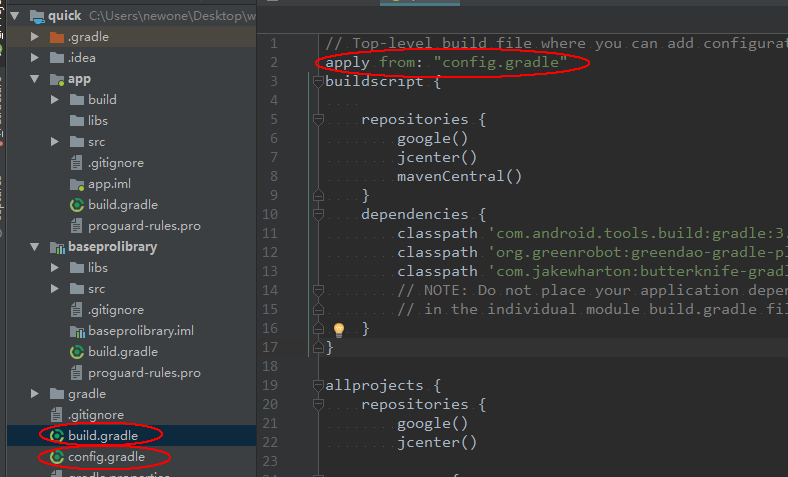

#### 如何集成
1. 将baseprolibrary 以module的形式导入到项目中
2. 将config.gradle 文件拷贝到项目目录下
3. 在项目的build.gradle文件顶部添加如下代码 ```apply from: "config.gradle" ```

4. 修改 你的项目 build.gradle 为：
    ```

    buildscript {

        repositories {
            google()
            jcenter()
            mavenCentral()
        }
        dependencies {
            classpath 'com.android.tools.build:gradle:3.0.1'
        }
    }
    allprojects {
        repositories {
            google()
            jcenter()
            maven {
                url "https://jitpack.io"
                name 'Google'

            }
        }
    }
    task clean(type: Delete) {
        delete rootProject.buildDir
    }

    ```
 5. 修改你的app 下的build.gradle 为：
       ```
        apply plugin: 'com.android.application'
        android {
            compileSdkVersion 26
            defaultConfig {
                applicationId "你自己的APPID"
                minSdkVersion rootProject.ext.android.minSdkVersion
                targetSdkVersion rootProject.ext.android.targetSdkVersion
                versionCode rootProject.ext.android.versionCode
                versionName rootProject.ext.android.versionName
                testInstrumentationRunner "android.support.test.runner.AndroidJUnitRunner"
                multiDexEnabled true

            }

            buildTypes {
                release {
                    minifyEnabled false
                    proguardFiles getDefaultProguardFile('proguard-android.txt'), 'proguard-rules.pro'
                }
            }
            compileOptions {
                sourceCompatibility JavaVersion.VERSION_1_8
                targetCompatibility JavaVersion.VERSION_1_8
            }
         }

        dependencies {
            implementation fileTree(include: ['*.jar'], dir: 'libs')
            implementation rootProject.ext.supportLibs
            testImplementation 'junit:junit:4.12'
            androidTestImplementation 'com.android.support.test:runner:0.5'
            implementation project(':baseprolibrary')
        }
    ```


#### 开启使用

1. 添加Application (记得添加到 清单文件中)
      ```
        public class XYTApplication extends MultiDexApplication {
            @Override
            public void onCreate() {
                super.onCreate();
                BaseInitApplication.with(this)
                       // .addUrl(KEY,VALUE)//外域api
                        .retrofit()//网络请求
                        .swipeBack()//侧滑返回
                        .zxing()//二维码
                        .skin()//主题切换
                        .fixFileProvide();//代码修复7.0文件 provide 问题
            }
        }
      ```
2. 使用设定好的主题 OblAppTheme 替换 AppTheme（也可自行修改为自己的）